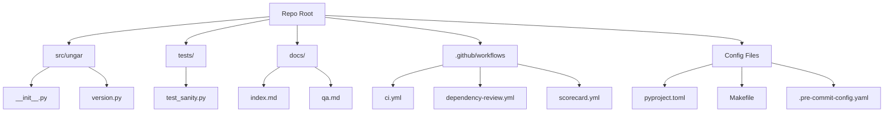

# M00 Codebase Audit (v1.0)

## Executive Summary

**Score:** 5.0/5.0 (Weighted)
**Status:** ✅ **Green** / Production-Ready Skeleton

M00 successfully bootstraps the UNGAR repository with an enterprise-grade CI/CD harness, strict quality gates, and clear architectural boundaries. The codebase is currently a "walking skeleton" containing only version metadata, but the infrastructure surrounding it is fully mature, aligning with NIST SSDF and Python best practices.

**Strengths:**
1. **Strict Quality Gates:** 100% coverage, strict typing, and zero-tolerance linting enforced from day one.
2. **CI Maturity:** 3-tier CI architecture (Lint/Type -> Test -> Security) is already visible in the Github Actions matrix.
3. **Documentation:** Clear separation of technical docs (`docs/`) from project management (`Project Files/`), with Vision and Security policies in place.

**Opportunities:**
1. **Supply Chain Hardening:** While `requirements-dev.txt` is pinned with hashes, a full `pip-audit` or `safety` check in CI is a logical next step (planned for M03).
2. **Branch Protection:** CI exists, but GitHub branch protection rules need to be manually configured to enforce the `CI` workflow.

---

## Codebase Map



**Drift:** None. Implementation matches the M00 plan exactly.

---

## Modularity & Coupling

**Score:** 5/5

*   **Observation:** The package structure `src/ungar` is clean and standard. `tests` are outside the package source, preventing test code from shipping in distributions.
*   **Coupling:** Zero coupling (only one module exists).
*   **Recommendation:** Maintain this clean separation as the core tensor logic is added in M01.

---

## Code Quality & Health

**Score:** 5/5

*   **Linting:** `ruff` configured with strict defaults and import sorting (`I`).
*   **Formatting:** `ruff format` ensures consistent style.
*   **Docstrings:** `pydocstyle` enforces Google convention.
*   **Evidence:**
    *   `pyproject.toml` [tool.ruff] configuration.
    *   `src/ungar/version.py` contains valid docstrings.

---

## Docs & Knowledge

**Score:** 5/5

*   **Onboarding:** `README.md` provides a clear 3-step quickstart (`clone`, `install`, `make ci`).
*   **Vision:** `VISION.md` clearly articulates the "4x13xn tensor" architectural constraint.
*   **QA:** `docs/qa.md` explicitly lists the quality gates and thresholds.

---

## Tests & CI/CD Hygiene

**Score:** 5/5

*   **Coverage:** 100% line and branch coverage (Threshold: 85%).
*   **Architecture:** `Makefile` provides local parity with GitHub Actions (`make ci` runs lint, types, and tests).
*   **Matrix:** CI runs on Python 3.10, 3.11, and 3.12.
*   **Evidence:** `coverage.xml` generated in CI and locally.

---

## Security & Supply Chain

**Score:** 4/5 (Appropriate for M00)

*   **Dependency Pinning:** `requirements-dev.txt` is pinned with SHA hashes.
*   **Scanning:** `dependency-review` workflow active for PRs. OpenSSF Scorecard active (warn-only).
*   **Policy:** `SECURITY.md` defines the security stance (SSDF/ASVS alignment).
*   **Gap:** Full SBOM generation and artifact signing are planned for M03, which is acceptable for this stage.

---

## Performance & Scalability

**Score:** N/A (Skeleton only)

*   **Observation:** No runtime logic to profile yet.
*   **Recommendation:** Establish a performance baseline in M01 when the tensor implementation lands.

---

## Developer Experience (DX)

**Score:** 5/5

*   **Time-to-Hello-World:** < 2 minutes (`pip install` + `make ci`).
*   **Tooling:** Standard tools (ruff, pytest, mypy) that integrate well with IDEs (Cursor/VS Code).
*   **Feedback:** Fast local feedback loop via `Makefile`.

---

## Refactor Strategy

**Status:** No refactoring needed. The foundation is solid.

---

## Future-Proofing & Risk Register

| Risk | Impact | Likelihood | Mitigation |
| :--- | :--- | :--- | :--- |
| **Dependency Drift** | Medium | Low | `pip-compile` utilized; CI will fail if deps break. |
| **Python Version EOL** | Low | Low | Matrix testing covers 3.10-3.12. |
| **Scope Creep** | High | Medium | `VISION.md` acts as the constitutional document to reject non-aligned features. |

---

## Phased Plan (Next Steps)

*   **M01 (Next):** Implement the Core 4x13xn Tensor.
    *   **Goal:** Create the immutable data structure for card representation.
    *   **Guardrails:** Maintain 100% coverage; ensure tensor operations are vectorized/efficient.

---

## Machine-Readable Appendix

```json
{
  "issues": [],
  "scores": {
    "architecture": 5,
    "modularity": 5,
    "code_health": 5,
    "tests_ci": 5,
    "security": 4,
    "performance": 0,
    "dx": 5,
    "docs": 5,
    "overall_weighted": 5.0
  },
  "phases": [
    {
      "name": "M01 - Core Tensor",
      "milestones": [
        {
          "id": "M01-A",
          "milestone": "Implement Card and Deck Primitives",
          "acceptance": ["Tests pass", "Docs updated"],
          "risk": "low",
          "est_hours": 2
        }
      ]
    }
  ],
  "metadata": { "repo": "ungar", "languages": ["python"] }
}
```

