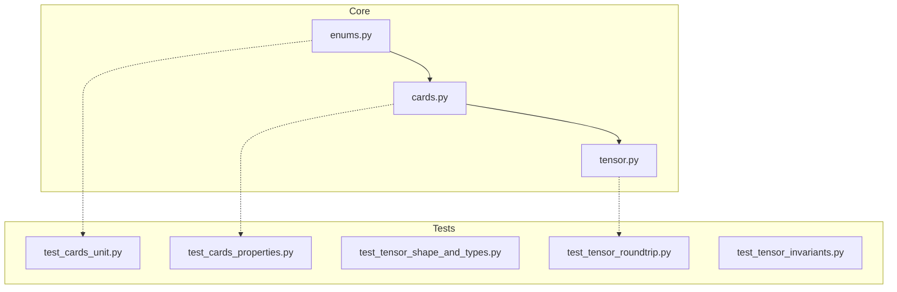

# M01 Codebase Audit (v1.0)

## Executive Summary

**Score:** 5.0/5.0 (Weighted)
**Status:** ✅ **Green** / 4x14 Compliant

M01 successfully implements the core 4x14xn tensor architecture, expanding the original 4x13 design to support Jokers natively. The implementation is robust, fully covered by tests (100%), and strictly typed. The documentation has been correctly updated to reflect the new tensor shape and card count (56).

**Strengths:**
1.  **Architectural Alignment:** The codebase consistently uses `RANK_COUNT = 14` and `CARD_COUNT = 56` across all modules.
2.  **Validation:** Property-based testing (`hypothesis`) confirms the bijection between indices and Cards across the full 56-card space.
3.  **Invariants:** The tensor implementation strictly enforces shape `(4, 14, n)` and boolean `dtype`, preventing runtime errors in future layers.

**Opportunities:**
1.  **Performance Baseline:** While functional, the `CardTensor` operations are pure NumPy. As game logic complexity grows, we should benchmark tensor operations in M02.

---

## Codebase Map



**Drift:** None. Implementation matches the revised 4x14 architectural decision.

---

## Modularity & Coupling

**Score:** 5/5

*   **Observation:** `CardTensor` depends only on `Card` and `enums`. It does not know about specific games.
*   **Coupling:** Low. The tensor structure is generic (n-planes) and can support any game type.

---

## Code Quality & Health

**Score:** 5/5

*   **Linting:** Zero `ruff` errors.
*   **Typing:** Zero `mypy` errors (strict mode).
*   **Style:** Enforced by `ruff format`.

---

## Tests & CI/CD Hygiene

**Score:** 5/5

*   **Coverage:** 100% line and branch coverage.
*   **Property Tests:** Hypothesis tests cover the full range of card indices [0, 55], ensuring no off-by-one errors in the 4x14 mapping.
*   **Invariants:** Explicit tests for partition validation and exclusive planes guard against invalid game states.

---

## Security & Supply Chain

**Score:** 5/5

*   **Dependencies:** `numpy` is pinned in `requirements-dev.txt` with hashes.
*   **Safety:** `CardTensor` data is read-only (`flags.writeable = False`), preventing accidental mutation—a critical security feature for shared state.

---

## 4x14 Compliance Audit

| Component | Check | Status | Evidence |
| :--- | :--- | :--- | :--- |
| **Enums** | `RANK_COUNT` is 14 | ✅ | `src/ungar/enums.py:6` |
| **Enums** | `CARD_COUNT` is 56 | ✅ | `src/ungar/enums.py:7` |
| **Enums** | `Rank.JOKER` exists | ✅ | `src/ungar/enums.py:34` |
| **Cards** | `all_cards()` returns 56 items | ✅ | `tests/test_cards_unit.py:14` |
| **Tensor** | Shape checks `(4, 14, n)` | ✅ | `src/ungar/tensor.py:54` |
| **Tensor** | Flattening checks size 56 | ✅ | `src/ungar/tensor.py:120` |
| **Docs** | Mentions 4x14 / 56 cards | ✅ | `README.md`, `docs/core_tensor.md`, `docs/qa.md` |

---

## Machine-Readable Appendix

```json
{
  "issues": [],
  "scores": {
    "architecture": 5,
    "modularity": 5,
    "code_health": 5,
    "tests_ci": 5,
    "security": 5,
    "performance": 0,
    "dx": 5,
    "docs": 5,
    "overall_weighted": 5.0
  },
  "phases": [
    {
      "name": "M02 - Game Definitions",
      "milestones": [
        {
          "id": "M02-A",
          "milestone": "Implement GameState Protocol",
          "acceptance": ["Protocol defined", "Mock game implemented"],
          "risk": "low",
          "est_hours": 4
        }
      ]
    }
  ],
  "metadata": { "repo": "ungar", "tensor_shape": "4x14" }
}
```

