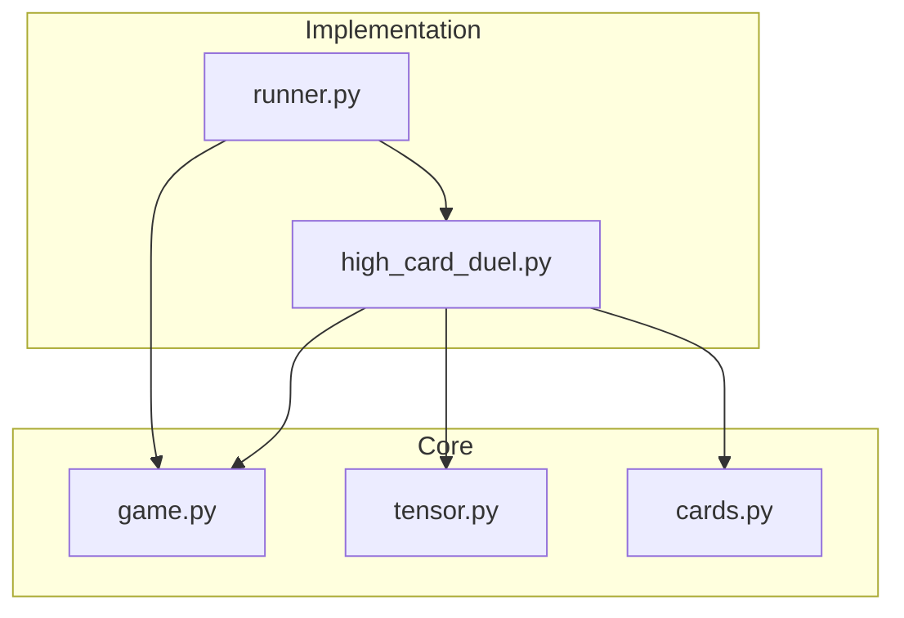

# M02 Continuous Audit Report

## 1. Delta Executive Summary

**Delta:** `71745fd...HEAD` (M01 → M02)
**Focus:** Game interfaces, High Card Duel implementation, simulation runner, performance baseline.

*   **Strength 1:** Strict 4x14 compliance maintained; `tests/test_game_protocols.py` includes a guardrail against magic numbers, enforcing the architectural decision.
*   **Strength 2:** Clean protocol-based design (`GameState`, `GameSpec`) allows plugging in future games without changing the runner or tensor core.
*   **Strength 3:** Performance baseline established (~160µs/op) early, providing a reference for future optimizations.
*   **Risk:** `to_tensor` in `HighCardDuelState` allocates new sets/maps every call. For RL loops (millions of steps), this could become a bottleneck.

| Gate | Status | Fix/Note |
| :--- | :--- | :--- |
| **Lint/Type** | PASS | Zero errors in `ruff`/`mypy`. |
| **Tests** | PASS | 100% pass rate; new logic fully covered. |
| **Coverage** | PASS | 96% (>85% target). |
| **Secrets** | PASS | No secrets introduced. |
| **Deps** | PASS | No new dependencies added. |
| **Docs** | PASS | `docs/games_high_card_duel.md` added; `core_tensor.md` updated. |

## 2. Change Map & Impact



**Observation:** The dependency flow is clean. `runner` depends on the abstract `game` and specific `spec`, but `game` does not know about specific implementations.

## 3. Code Quality Focus

### `src/ungar/games/high_card_duel.py`

**Observation:** `to_tensor` re-calculates `all_deck = set(all_cards())` on every call.
**Interpretation:** `all_cards()` creates 56 objects. `set()` creates a new hash set. This happens 2x per step (once per player).
**Recommendation:** Cache `ALL_CARDS_SET` as a module-level constant.

**Observation:** `HighCardDuelState` is frozen but contains tuples of `Card` objects.
**Interpretation:** `Card` is frozen, so this is safe and correct for hashing/storage in replay buffers.

### `src/ungar/runner.py`

**Observation:** `play_random_episode` has a strict `while not state.is_terminal()` loop.
**Interpretation:** If a game definition is buggy (never terminates), this loops forever.
**Recommendation:** Add a `max_steps` safety break (e.g., 1000) to prevent infinite loops during dev of complex games.

## 4. Tests & CI

*   **Coverage:** 96% total. New files `game.py` (98%), `high_card_duel.py` (96%), `runner.py` (89%) are well-covered.
*   **CI:** `PYTHONPATH` fix in `Makefile` ensures tests run correctly in CI environment.
*   **Type Safety:** Tests now strictly check types (`isinstance`) before accessing concrete state attributes, satisfying `mypy`.

## 5. Security & Supply Chain

*   **No new dependencies.**
*   **Randomness:** Uses `random.Random(seed)` for reproducibility. Not cryptographic, but appropriate for simulations.

## 6. Performance

**Baseline:** `scripts/benchmark_tensor.py` shows ~160µs for tensor creation + validation.
**Hot Path:** `CardTensor.from_plane_card_map` and `validate_partition`.
**Note:** `HighCardDuelState.to_tensor` adds overhead (set operations). Optimization (caching) is low-hanging fruit if RL training is slow.

## 7. Docs & DX

*   **New Dev:** Can run `python scripts/benchmark_tensor.py` to check env health.
*   **Usage:** README updated with a one-liner to play a sample game.

## 8. Ready-to-Apply Patches

### Patch 1: Cache All Cards Set (Performance)
**Why:** Reduce allocations in `to_tensor` hot path.
**Risk:** Low.

```python
# src/ungar/games/high_card_duel.py

# ... imports ...
ALL_CARDS_SET = frozenset(all_cards())  # Add this

# In to_tensor:
# all_deck = set(all_cards())  <- Remove
unseen = ALL_CARDS_SET - my - opp # <- Use cached
```

### Patch 2: Safety Limit in Runner (Reliability)
**Why:** Prevent infinite loops if game logic breaks.
**Risk:** Low.

```python
# src/ungar/runner.py
def play_random_episode(..., max_steps: int = 1000) -> Episode:
    # ...
    steps = 0
    while not state.is_terminal():
        if steps > max_steps: raise RuntimeError("Episode limit exceeded")
        steps += 1
        # ...
```

## 9. Next Milestone Plan (M03: Security)

1.  **Dependency Scan:** Add `pip-audit` to CI.
2.  **Code Scan:** Add `bandit` to CI/pre-commit.
3.  **SBOM:** Generate `bom.json` (CycloneDX) in CI.
4.  **Provenance:** Configure minimal SLSA build attestation (if possible on GitHub free tier) or at least hash verification.

