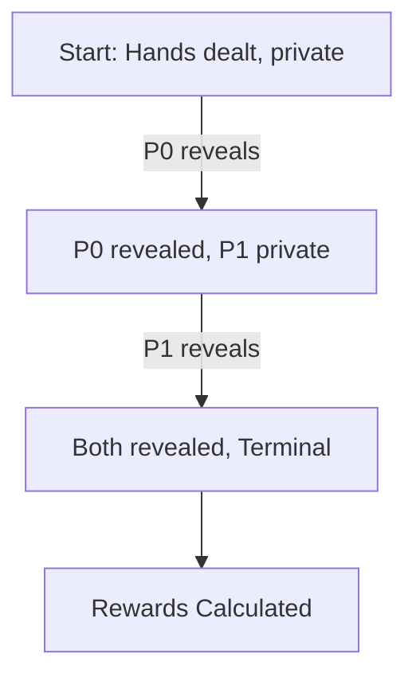

# High Card Duel

A minimal 2-player game implemented on the UNGAR 4×14 substrate to demonstrate the core game interfaces.

## Rules

1.  **Setup**:
    *   Deck: Standard 52 cards + 4 Jokers (though usually 1 deck is enough).
    *   Players: 2 (ID 0 and ID 1).
    *   Deal: Each player receives **1 private card**.

2.  **Gameplay**:
    *   **Player 0 Turn**: Must play `reveal`.
    *   **Player 1 Turn**: Must play `reveal`.
    *   **End**: Once both cards are revealed, the game ends.

3.  **Winning**:
    *   The player with the higher ranked card wins.
    *   **Ranking**: `2 < 3 < ... < K < A < Joker`.
    *   **Rewards**: `(1.0, -1.0)` for P0 win, `(-1.0, 1.0)` for P1 win, `(0.0, 0.0)` for tie.

## State Transitions

## Tensor Representation

The game uses 3 planes to represent the state to an agent:

| Plane | Description |
| :--- | :--- |
| `my_hand` | The card held by the agent. Always visible. |
| `opponent_hand` | The card held by the opponent. Empty until the opponent reveals. |
| `unseen` | All other cards in the deck, plus the opponent's card if unrevealed. |

This ensures that at step 1, Player 0's tensor has `opponent_hand` empty, reflecting that they do not know what Player 1 holds. At step 2 (after P1 reveals), the tensor would show the card in `opponent_hand`.

